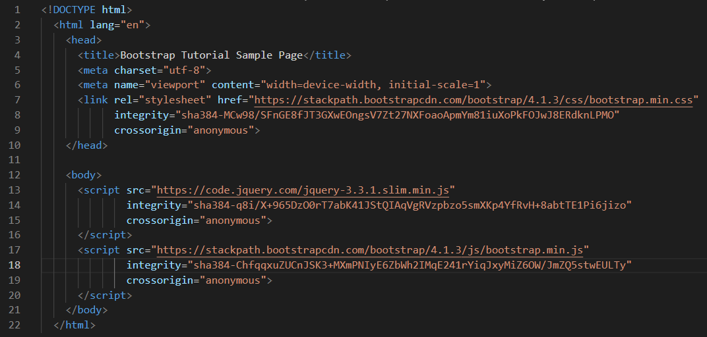
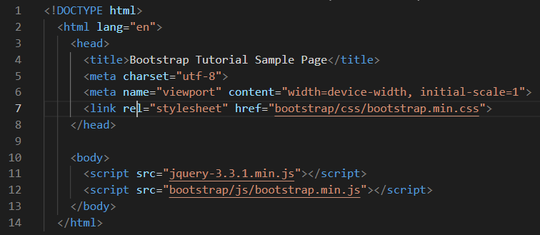
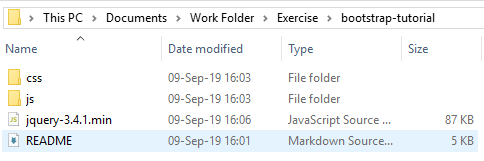

# **Bootstrap Framework**

## **What is the Bootstrap framework and how do we use it?**
Bootstrap is a useful front-end framework that helps with website design, mainly through the use of CSS and JavaScript. It can create responsive websites with preinstalled design patterns using forms, buttons, columns, etc. It has many CSS styles that can be applied to HTML tags, to transform a simple website into something much more user friendly. 

## **How to set up the Bootstrap framework**
There are two ways to use the Bootstrap framework on your website. We can either choose to host it *locally* or via *CDN (content delivery method)*. There are no differences in terms of display between these two methods, but there are in terms of usability and availability. 

***Loading Bootstrap using CDN (content delivery method)***  
To host bootstrap via CDN, we can just copy paste a simple `<link>` to our `<head>` section of our HTML page. 
```html
<link rel="stylesheet" href="https://stackpath.bootstrapcdn.com/bootstrap/4.1.3/css/bootstrap.min.css" integrity="sha384-MCw98/SFnGE8fJT3GXwEOngsV7Zt27NXFoaoApmYm81iuXoPkFOJwJ8ERdknLPMO" crossorigin="anonymous">
```
Using this method, which simply accesses the internet and allows you to use Bootstrap with an internet connection, can result in faster loading time of your webpage. However, if we are only using Bootstrap for simple testing, we can host it locally.

***Hosting Boostrap locally***  
To host locally, we must download Bootstrap directly to our hard drive, and use those files locally. To download, use the official [Bootstrap website](https://getbootstrap.com/docs/4.2/getting-started/download/) and choose **Compiled CSS and JS**. After downloading the .zip file, extract its contents to the same directory as your index.html. Again, copy this `<link>` to our `<head>` section. 
```html
<link rel="stylesheet" href="bootstrap/css/bootstrap.min.css">
```
This method differs as it can be used offline, independent of internet connection. This is mainly for personal use and testing, or when access to the internet is limited. 

***Setting up jQuery library to use alongside Bootstrap***  
To use Bootstrap's full functionality, we also need to download and install jQuery. Like Bootstrap, there are two ways to load the library, locally and via CDN.  

For **CDN**, paste the following code right before the end body tag `</body>`.
```html
<script src="https://code.jquery.com/jquery-3.3.1.slim.min.js" integrity="sha384-q8i/X+965DzO0rT7abK41JStQIAqVgRVzpbzo5smXKp4YfRvH+8abtTE1Pi6jizo" crossorigin="anonymous"></script>
```

To host **locally**, download jQuery from the [official website](https://jquery.com/download/), extract its contents to the directory of your index.html file, and paste the following code before the end of the body tag `</body>`. 
```javascript
<script src="jquery-3.3.1.min.js"></script>
```

***Loading up Bootstrap JavaScript***  
Again, JavaScript for Bootstrap can be hosted remotely or locally. No download is required to host it locally as it was already downloaded with Bootstrap (if you chose to host it locally).

For **CDN**, paste the following code **after** the call for jQuery.
```html
<script src="https://stackpath.bootstrapcdn.com/bootstrap/4.1.3/js/bootstrap.min.js" integrity="sha384-ChfqqxuZUCnJSK3+MXmPNIyE6ZbWh2IMqE241rYiqJxyMiZ6OW/JmZQ5stwEULTy" crossorigin="anonymous"></script>
```

To host **locally**, paste the following code **after** the call for jQuery. 
```html
<script src="bootstrap/js/bootstrap.min.js"></script>
```

## **Check Your Work!**
If you followed all these steps, make sure you have a file that resembles something below before you start!  

Following this tutorial and setting up using **CDN**, your code should match/resemble the code below.



If you followed this example and set up bootstrap **locally**, match your code with the picture below. 



Also, you must check your file explorer/finder and verify that the directories are set up correctly. If they are not, bootstrap will not work on your computer even if your code is correct.  Your files and folders should match the image below. 



